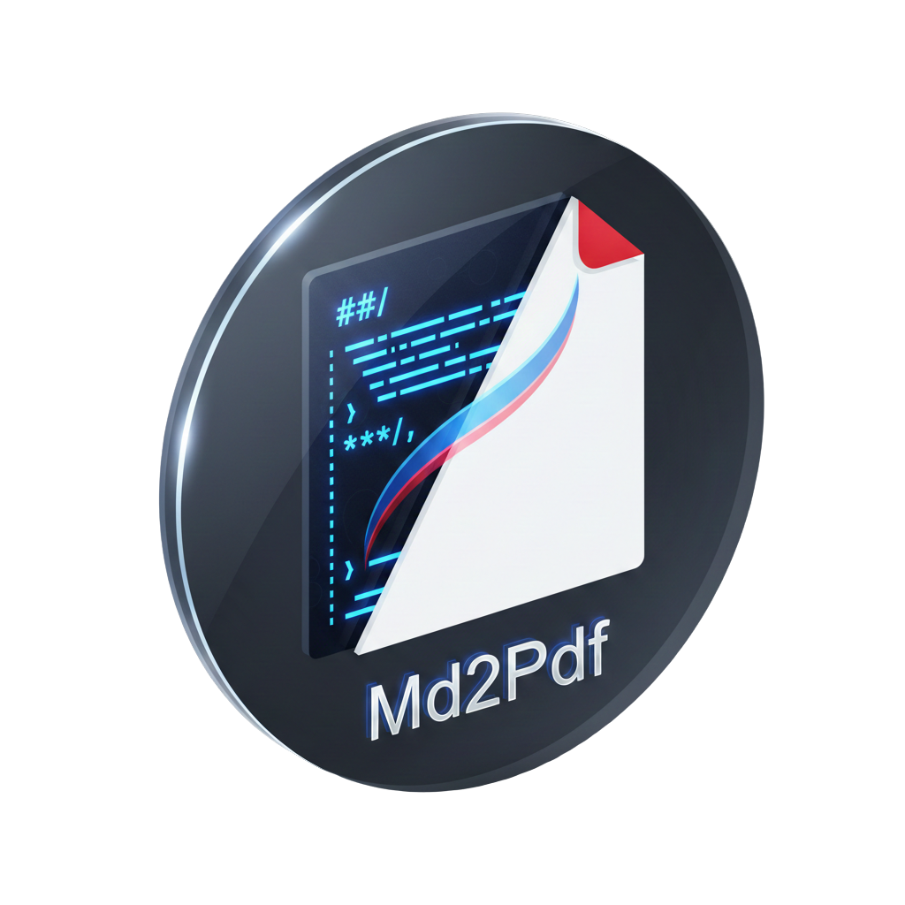
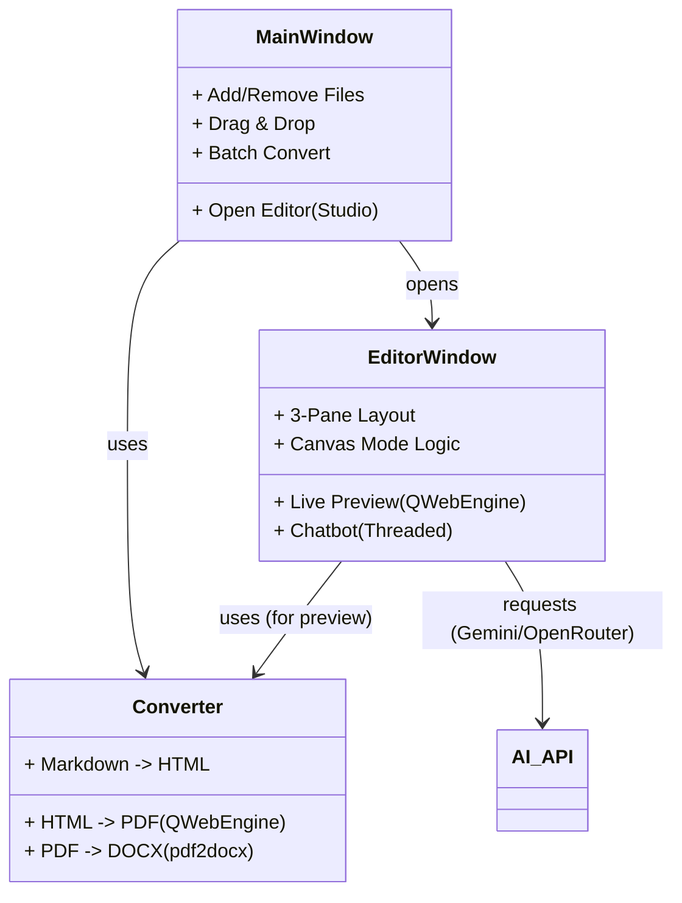

# Md2Pdf Converter & Studio

**Md2Pdf** is a powerful all-in-one desktop application for creating, editing, and converting technical documentation. Built with **Python** and **PyQt6**, it combines a robust Markdown converter with a Feature-rich **AI-Assisted Editor**.



## 🚀 Features

### 📄 Conversion Functionality
*   **Markdown to PDF**: Converts `.md` files to high-quality PDFs using the **Chromium-based** `QWebEngine` for pixel-perfect rendering.
*   **PDF to DOCX**: Automatically convert generated PDFs into editable Microsoft Word (`.docx`) documents.
*   **Batch Processing**: Convert multiple files simultaneously.
*   **Rich Content Support**:
    *   **LaTeX Math**: Renders complex formulas (e.g., `$$ E=mc^2 $$`) using MathJax.
    *   **Mermaid Diagrams**: Renders Flowcharts, Sequence diagrams, Gantt charts, etc.
    *   **Syntax Highlighting**: Beautiful code blocks for all languages.

### ✍️ Md2Pdf Studio (Integrated Editor)
Double-click any file or create a **New File** to enter the **Studio Mode**:
*   **3-Pane Layout**:
    1.  **Live Preview**: Real-time rendering of your document (Left).
    2.  **Canvas (Editor)**: A distraction-free coding environment (Center).
    3.  **AI Assistant**: A built-in Chatbot (Right).
*   **AI-Powered Editing (Canvas Mode)**:
    *   **Canvas Mode (✏️)**: When enabled, the AI Assistant has "write access" to your editor. You can ask it to *"Translate this to English"*, *"Fix bugs in the code"*, or *"Rewrite the introduction"*, and it will update the text directly in the editor.
    *   **Chat Mode**: When Canvas is disabled, the AI only reads and advises.
*   **Multi-Provider AI**: Supports **Google Gemini** and **OpenRouter** (GPT-4, Claude, etc.).
*   **Advanced Toolbar**: Quick formatting, specific Insert buttons, and toggle controls for panels.
*   **Find & Replace**: Full search functionality within the editor.

## 🛠️ Installation

1.  **Prerequisites**: Python 3.8+ installed.
2.  **Install Dependencies**:
    ```bash
    pip install -r requirements.txt
    ```

## 🖥️ Usage

Run the application:
```bash
python src/main.py
```

### Conversion Workflow
1.  **Add Files**: Drag & drop `.md` files into the list.
2.  **Options**:
    *   Check **"Convert to Word (.docx)"** if you need Word output.
    *   Select an Output Directory (optional).
3.  **Convert**: Click the main button to process all files.

### Editor Workflow
1.  **Open Editor**: Double-click a file in the list or click **"Yeni Dosya"** (New File).
2.  **Setup AI**: Click the **Settings (⚙️)** icon in the toolbar.
    *   Select Provider (Google Gemini or OpenRouter).
    *   Enter your API Key.
3.  **Edit & Interact**:
    *   Type Markdown in the center pane.
    *   Watch the **Live Preview** on the left.
    *   Chat with the **AI Assistant** on the right.
    *   Toggle **Canvas Mode (✏️)** in the toolbar to let the AI write for you.

## 🏗️ Architecture



## 📦 Requirements

*   `PyQt6` (GUI)
*   `PyQt6-WebEngine` (Rendering)
*   `Markdown` (Parsing)
*   `pdf2docx` (Word Conversion)
*   `requests` (API Calls)
*   `pymdown-extensions` (Math/Mermaid support)
